# LetsGal Studio 自定义手机扩展

> 扩展包 ID：`ink.zenly.ext-7a9373`｜ 程序 UI：`phone`、`phone-toast`  
> 扩展版本：`1.1.1` ｜ 要求 LetsGal Studio SDK：`>=1.9.0`

剧情挂载的游戏内手机：四列 APP 桌面、安全启动动作、玩家个性化、APP 安装/禁用、逐条聊天消息，以及独立 Toast 通知。

## 目录

1. [能力范围与限制](#1-能力范围与限制)
2. [安装、构建与重载](#2-安装构建与重载)
3. [五分钟完成第一个手机](#3-五分钟完成第一个手机)
4. [运行生命周期与打开方式](#4-运行生命周期与打开方式)
5. [作者设置：外观、动作和 APP](#5-作者设置外观动作和-app)
6. [剧情管理 APP 与 Toast 通知](#6-剧情管理-app-与-toast-通知)
7. [玩家个性化与 shared 存档](#7-玩家个性化与-shared-存档)
8. [聊天角色预设与头像](#8-聊天角色预设与头像)
9. [`show-message` 聊天消息](#9-show-message-聊天消息)
10. [Preview、缓存与多预览隔离](#10-preview缓存与多预览隔离)
11. [调试、验收与常见问题](#11-调试验收与常见问题)
12. [更新日志](#12-更新日志)

## 1. 能力范围与限制

### 已提供的能力

- 苹果 / 安卓两套外壳；四列 APP 桌面；键盘、鼠标与快捷键打开。
- 动作：程序 UI、可视化 UI、内置系统界面、快速存档/读档/全屏，以及手机内部应用（内页）。
- APP 默认排序、预装、可用、锁定玩家编辑；剧情中安装、删除、禁用、解禁。
- 禁用 APP 仍留在桌面但变暗不可启动；删除才移出桌面。
- APP 管理可选 Toast（九宫格位置、堆叠、入退场动画）；快进/跳过不显示。
- 玩家可改非锁定 APP 的名称、图标、动作；作者可控制背景/图标上传权限。
- 聊天角色预设、消息状态、组接续、组级聊天背景；可选气泡样式与头像/名称显示控制；可将我方「未读」在对方回复前点击改为「已读」。
- 玩家偏好与 APP 剧情状态写入扩展 `shared` 存档。

## 2. 安装、构建与重载

### 环境

- Node.js、pnpm
- LetsGal Studio SDK `>=1.9.0`

### 首次构建

```powershell
pnpm install
npx tsc --noEmit
pnpm run build
```

Studio 加载 `extension.json` 中的 `dist/index.mjs`。

开发内页或脚手架见 [`src/README.md`](src/README.md)。

## 3. 五分钟完成第一个手机

### 第一步：系统界面动作


扩展设置 → **动作 · 内置系统界面**：

| 字段 | 示例 |
| --- | --- |
| ID | `open-settings` |
| 名称 | `设置` |
| 系统界面 | `设置界面` |

ID 建议小写 + 数字 + 连字符，同分组内唯一。

### 第二步：桌面 APP


**手机应用目录**：

| 字段 | 示例 |
| --- | --- |
| 应用 ID | `settings-app` |
| 应用名称 | `设置` |
| 默认排序 | `0` |
| 游戏开始默认预装 | 开启 |
| 作者默认可用 | 开启 |
| 默认动作 ID | `open-settings`（须与上一步 ID 完全一致） |

### 第三步：剧情挂载


允许使用手机的剧本处添加 **调用扩展方法 → 挂载手机**（`mount-phone`）。不会自动弹出，只启用能力。

### 第四步：剧本 Preview

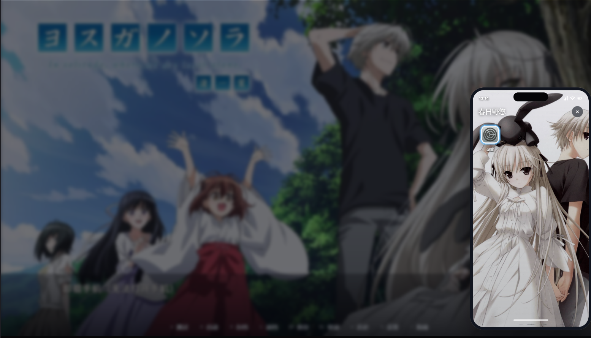

运行剧本 Preview，按默认快捷键 `ArrowUp` 打开手机，启动「设置」APP。  
未配置有效 APP 时，会回退内置存档/读档/设置等 APP，便于先验 UI。

## 4. 运行生命周期与打开方式

```text
游戏开始或允许使用手机
  └─ mount-phone
       ├─ 快捷键打开普通手机
       ├─ show-message
       ├─ 管理 APP
       └─ 不再需要时 unmount-phone
```

| 方法 | ID | 正常播放 | 快进 / 跳过 |
| --- | --- | --- | --- |
| 挂载手机 | `mount-phone` | 启用，不自动显示 | 同样启用 |
| 卸载手机 | `unmount-phone` | 关闭 UI、结束等待、禁用 | 同样卸载 |
| 添加或删除 APP | `manage-installed-apps` | 改 shared；可 Toast | 改状态，无 Toast |
| 禁用或解禁 APP | `manage-app-enabled-state` | 改 shared；可 Toast | 改状态，无 Toast |
| 显示手机消息 | `show-message` | 显示并等待逐条确认 | 不显示、不等待 |

挂载状态只在当前运行时有效，建议每个进入游戏流程的起点重新 `mount-phone`。  
`unmount-phone` 不会清除个性化与 APP 剧情状态。

### 操作方式

| 输入 | 行为 |
| --- | --- |
| 打开手机快捷键（默认 `ArrowUp`） | 未打开则打开；已打开且键为 `ArrowUp` 则焦点上移 |
| 方向键 | 四列桌面移动焦点 |
| `Enter` / `Space` / 点击 | 启动 APP |
| `Escape` / 关闭 / 遮罩 | 关闭普通手机 |

打开手机语义动作（本仓）：

```text
ink.zenly.ext-7a9373.open-phone
```

可在扩展设置「打开手机快捷键」或 Studio「输入按键」中映射。未挂载、消息手机显示中、已打开时，打开动作会被忽略。


## 5. 作者设置：外观、动作和 APP

### 5.1 外观

| 设置 | 说明 |
| --- | --- |
| 手机标题 | 普通手机顶栏，默认「手机」；消息模式固定「消息」 |
| 打开手机快捷键 | 默认 `ArrowUp`；支持 `KeyP`、`Ctrl+KeyP`、`F5` 等 |
| 手机样式预设 | 苹果（动态岛）/ 安卓；不覆盖下方颜色与背景 |
| 手机弹出位置 | 左上～右下、中部等 |
| 默认背景色 / 背景图 / CSS 背景 | CSS 须为单值，禁止 `url()`、`;`、`{}`、`@` |
| 默认强调色 / 外壳颜色 | 焦点与我方气泡、外壳 |
| 对方回复前将我方未读标为已读 | 默认开启。下一条为对方消息且屏幕上有我方「未读」时，点击先改为「已读」，再点才出对方消息；见 [§9](#9-show-message-聊天消息) |

### 5.2 先动作，再 APP

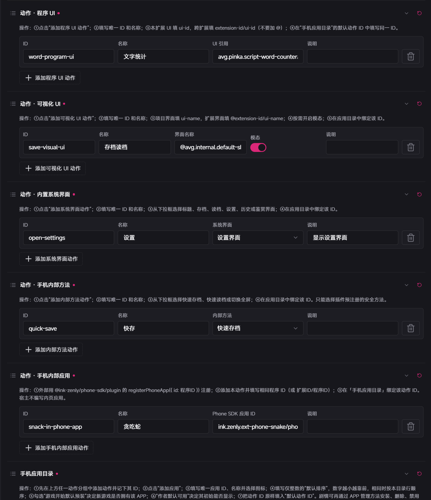

| 分组 | 用途 |
| --- | --- |
| 动作 · 程序 UI | 本扩展 `ui-id`；跨扩展 `extension-id/ui-id`（无 `@`） |
| 动作 · 可视化 UI | 项目 `ui-name`；扩展 `@extension-id/ui-name` |
| 动作 · 内置系统界面 | 标题、工具栏、存档、读档、设置、历史、鉴赏 |
| 动作 · 手机内部方法 | 快速存档 / 读档 / 切换全屏 |
| 动作 · 手机内部应用 | `phoneAppId` = 内页 `registerPhoneApp` 的 id；不关手机 |

动作 ID 发布后勿随意改名（已绑定 APP / 玩家绑定不会自动迁移）。  
不能执行任意脚本；跨扩展方法请用 Fragment +「调用扩展方法」。

**注意：**如何寻找UI的ID？

**a.程序UI**

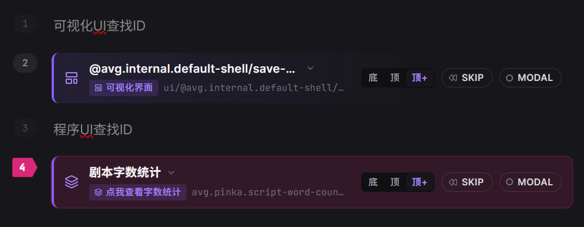

在剧本处，挂载你需要的程序UI，在检查器中就可看到对应的ID。
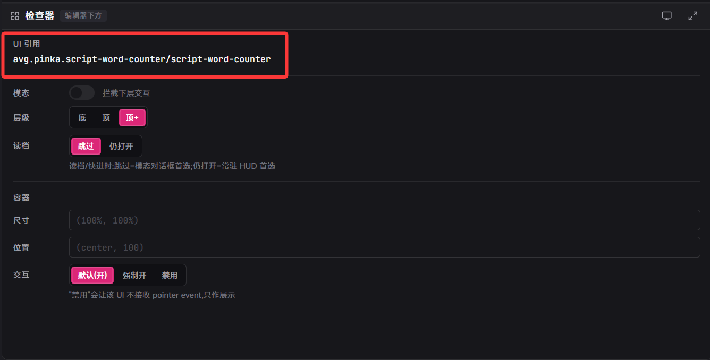

**b.可视化UI**

同理，使用时去掉`ui:@`即可

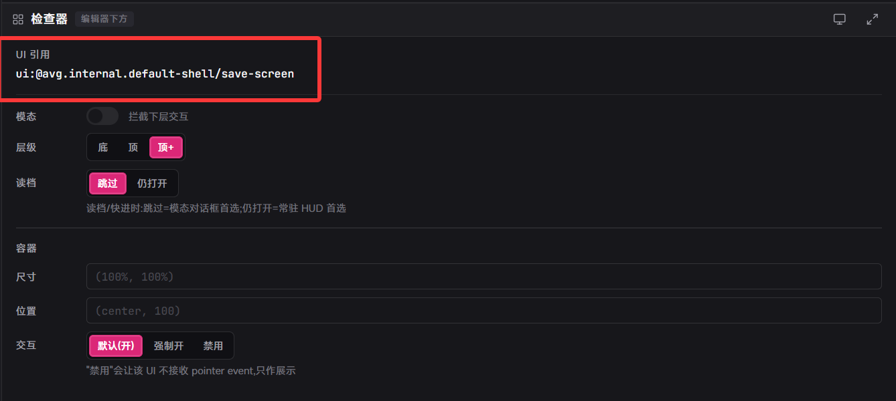

**c.手机内页UI**

这个目前需要内页扩展开发者提供，暂时没有对应的获取方法。内页UI的ID为：如果内页是其他基于手机扩展开发的内页扩展需要`扩展ID`+`内页ID`，如果内页是手机扩展内部的内页UI，则去掉`扩展ID/`即可。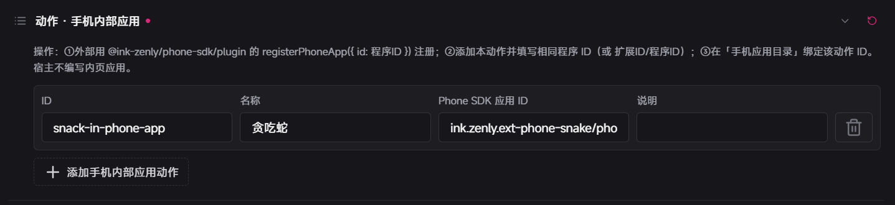

如图：内页UI的ID为`ink.zenly.ext-phone-snake/phone-snake`，如果为手机扩展自带的内页，则为`phone-snake`

### 5.3 手机应用目录（最多 40）

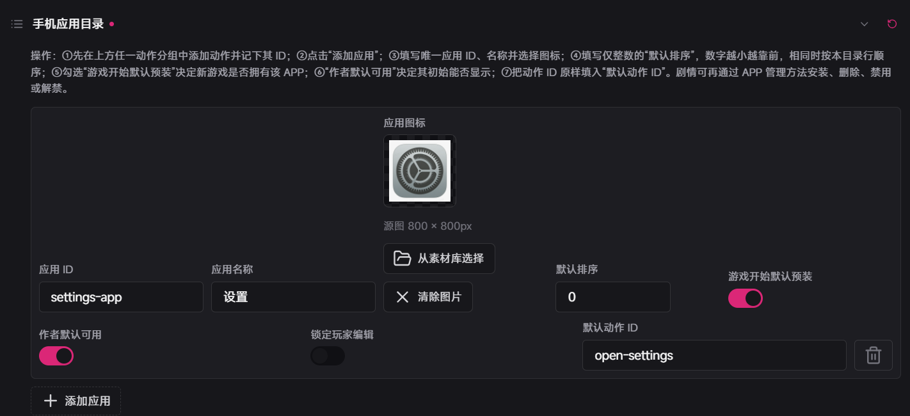

| 字段 | 作用 |
| --- | --- |
| 应用 ID | 剧情管理用稳定 ID |
| 应用名称 | 桌面显示名（≤24 字） |
| 应用图标 | 作者默认图标 |
| 默认排序 | `0`～`9999`，越小越靠前 |
| 游戏开始默认预装 | 关则需剧情「添加」才出现 |
| 作者默认可用 | 关则暗化，需「解禁」 |
| 锁定玩家编辑 | 禁止玩家改名/图标/动作 |
| 默认动作 ID | 必须指向已有动作；无效则不进桌面 |

无有效作者目录时回退内置存档/读档/设置等（仅保底，勿当正式配置）。

## 6. 剧情管理 APP 与 Toast 通知

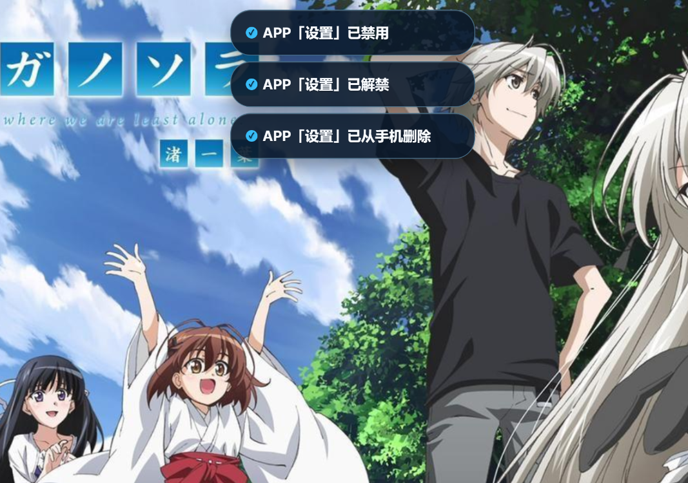

安装与可用独立：**删除**移出桌面；**禁用**保留暗化图标。

### 6.1 添加或删除

Fragment → **添加或删除手机 APP** → 操作 + 最多 8 个应用 ID。未知 ID 忽略。删除不清除玩家个性化偏好。

### 6.2 禁用或解禁

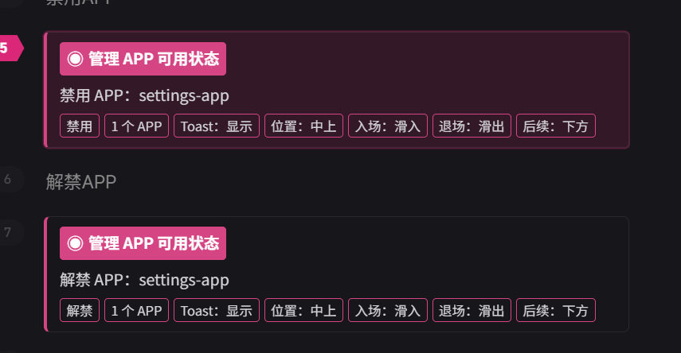

Fragment → **禁用或解禁手机 APP**。解禁不会重新安装已删除的 APP。可在未挂载时执行。

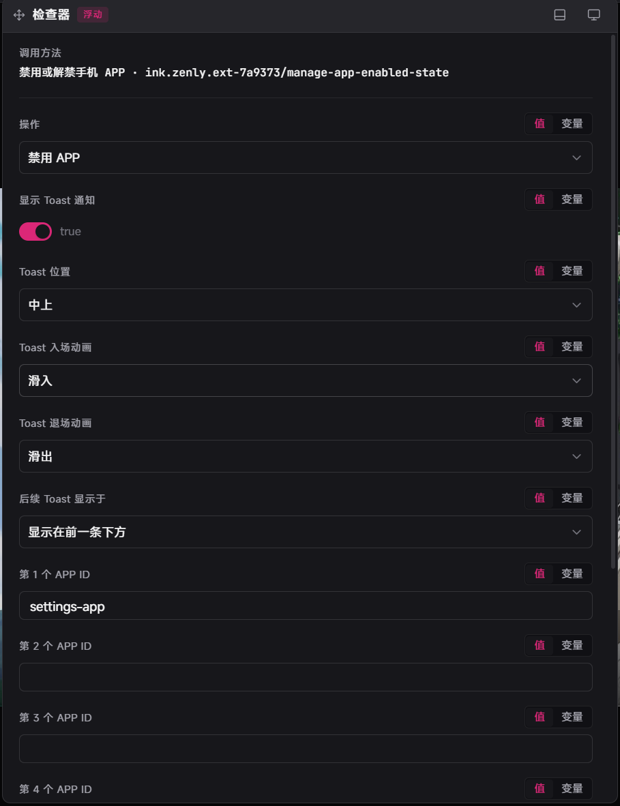

### 6.3 Toast（可选）

Inspector 开启「显示 Toast 通知」后，正常 `run` 显示；快进 / `runImmediately` / `skip` 只改状态不弹 Toast。  
可配位置、入退场动画、上下堆叠。文案优先用应用名称。时长约 2.6 秒。

## 7. 玩家个性化与 shared 存档

| 开关 | 行为 |
| --- | --- |
| 允许玩家个性化手机 | 总开关；关则隐藏齿轮并忽略覆盖 |
| 允许玩家更换背景 / 图标 | 总开关开启时分别生效 |

玩家可改壁纸、安全 CSS 背景、强调色/外壳色、非锁定 APP 的名称/图标/动作绑定，或恢复作者默认。  
背景图 PNG/JPEG/WebP ≤2MB；图标 ≤512KB。偏好在 `preferences` shared；APP 剧情状态在 `appAvailability` shared。

**注意：**目前暂未完全完善，建议作者关闭此项

## 8. 聊天角色预设与头像

`show-message` 引用「聊天角色预设」，不直接选立绘。

### 头像素材库（可选）

仅当预设头像来源为「扩展素材库」时需要：素材 ID + 图片（最多 80）。

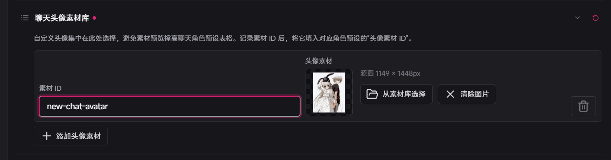

### 聊天角色预设

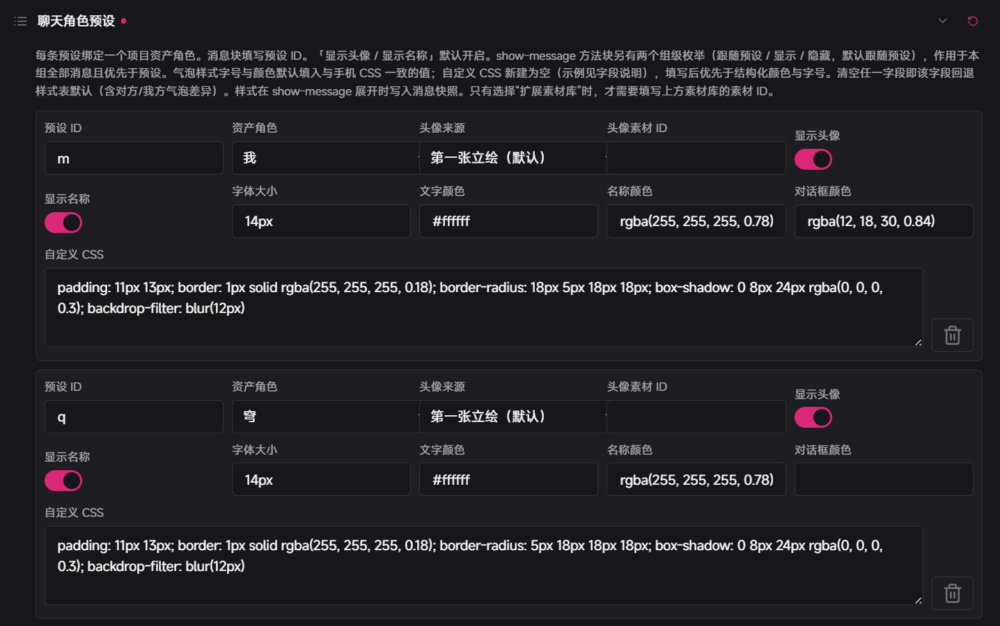

| 字段 | 说明 |
| --- | --- |
| 预设 ID | 如 `mika`，供消息块填写 |
| 资产角色 | 项目角色资产 |
| 头像来源 | 第一张立绘 / 角色默认头像 / 扩展素材库 |
| 头像素材 ID | 仅扩展素材库时填 |
| 显示头像 / 显示名称 | 默认开 |
| 字体大小 / 文字颜色 / 名称颜色 / 对话框颜色 | 可预填；清空回退样式表 |
| 自定义 CSS | 新建不预填；声明列表；与结构化字段并存时 **优先** |

名称取自资产角色，显示在气泡上方并加粗（对方左、我方右）。样式在消息开始时写入快照。  
`show-message` 组级「显示头像 / 显示名称」：`跟随预设` / `显示` / `隐藏`（优先于预设）。

| 规则 | 说明 |
| --- | --- |
| 清空回退 | 空字段不写 inline，保留样式表（含对方/我方差异） |
| customCss 优先 | 同名声明覆盖结构化字段 |
| 安全 | 禁止 `url()`、`@`、花括号等；非法则整段丢弃 |

头像回退：预设来源 → 旧立绘数据 → 角色默认头像 → 第一张立绘 → 名称首字。

**注意：**如果想要修改四个角的圆角请在自定义css中修改。

## 9. `show-message` 聊天消息

### 前置

- 已 `mount-phone`
- 至少一条有效预设；第 1 条有预设 ID 与非空内容
- 使用**剧本 Preview**

一个块最多 8 条消息。

### 单条字段

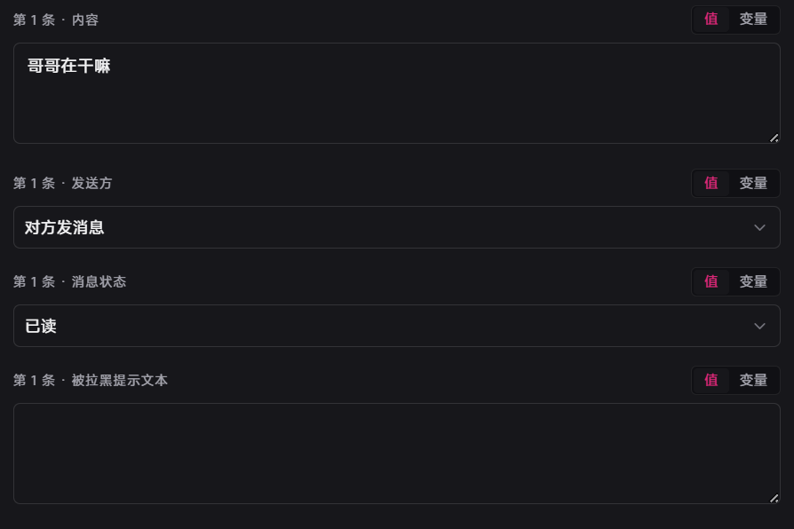

| 字段 | 第 1 条 | 第 2～8 条 |
| --- | --- | --- |
| 预设 ID | 必填 | 空则继承第 1 条 |
| 内容 | 多行；空则跳过 | 同左 |
| 发送方 | `incoming` 左 / `outgoing` 右 | 同左 |
| 消息状态 | 默认 `read`；对方始终已读 | 同左 |
| 被拉黑提示 | 仅我方 `blocked` | 同左 |

### 组级字段

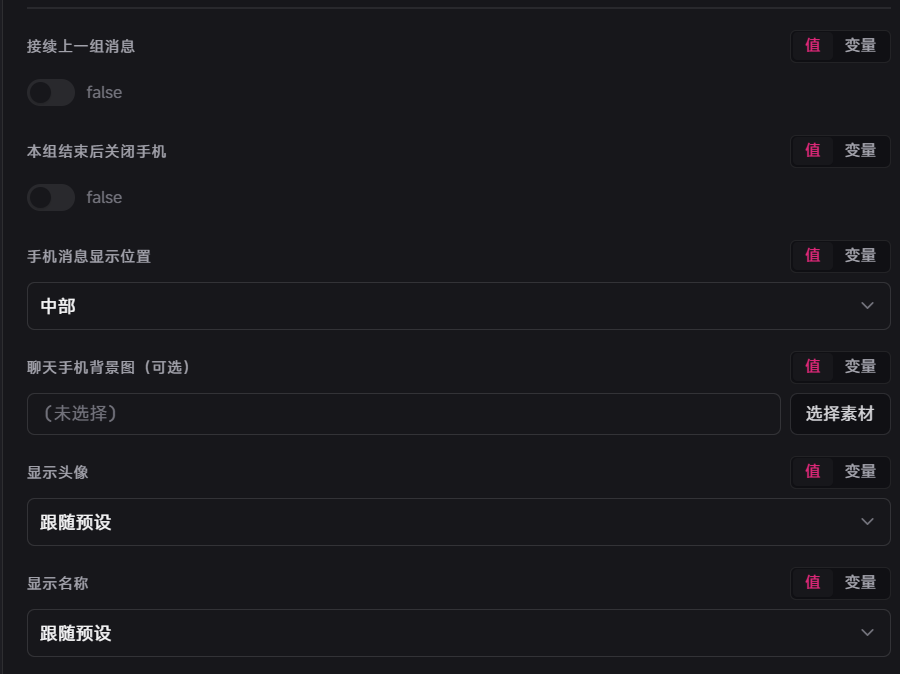

| 字段 | 默认 | 说明 |
| --- | --- | --- |
| 接续上一组 | 否 | 前一组未关闭时可追加 |
| 结束后关闭手机 | 是 | 最后一条后再确认一次才关 |
| 消息显示位置 | 右下 | 仅消息手机 |
| 聊天背景图 | 空 | 仅本消息组；不写 shared |
| 显示头像 / 名称 | 跟随预设 | `show` / `hide` 强制本组 |

### 我方状态显示

`sending`（loading）/ `unread` / `read` / `failed`（红叹号）/ `blocked`（叹号 + 拒收提示行）。

### 未读 → 已读（设置）

扩展设置 **对方回复前将我方未读标为已读**（默认开启）：

1. 屏幕上已有我方消息状态为 `unread`
2. 且下一条待显示的是**对方**消息（`incoming`）
3. 此时点击屏幕或按 `Enter` / `Space`：先把这些我方未读改为「已读」，**不**追加下一条
4. 再操作一次：才显示对方消息

下一条仍是我方、或没有未读时，与关闭该设置相同（一次点击直接推进）。关闭设置后，点击始终直接推进。

### 推进

首条立即出现 → 点击消息区或 `Enter`/`Space` 追加下一条（若开启上节设置且满足条件，会先占用一次点击改为已读）→ 若开启关闭则再确认一次后关手机并续剧情。  
`Escape` 关闭消息手机并结束等待。超过 8 条用多块接续：前几组「结束后关闭=否」+ 后续「接续=是」，组间勿 `unmount-phone`。

## 10. Preview、缓存与多预览隔离

| Preview | 用途 | 不能验证 |
| --- | --- | --- |
| 剧本 Preview | `mount-phone`、APP 管理、消息、接续 | — |
| 扩展程序 Preview | 桌面外观、背景、布局 | 挂载、快捷键、启 APP、剧情消息 |

每个 Preview 独立运行时，须各自 `mount-phone`。  
表单未更新时：`pnpm run build` 后重载扩展/重启 Preview。

编辑器内联方法卡片为实验性摘要（不改 Fragment 数据）；参数仍在 Inspector 编辑。

## 11. 调试、验收与常见问题

### 验收清单

- [ ] 流程中已 `mount-phone`；未挂载时快捷键无效
- [ ] 方向键 / 鼠标 / Enter·Space 可启动 APP；动作 ID 有效
- [ ] 安装/删除/禁用/解禁表现正确；Toast 与快进抑制符合预期
- [ ] 个性化开关与锁定 APP 符合预期
- [ ] 消息逐条推进、接续与背景符合预期
- [ ] 剧本 Preview 能跑通完整链路

### 常见问题

| 现象 | 优先检查 |
| --- | --- |
| 快捷键无反应 | 是否已 `mount-phone`；快捷键与 Studio 映射；是否已有手机打开 |
| APP 不出现 | 是否预装、是否被删除、默认动作 ID 是否有效 |
| APP 变暗不能点 | 已被禁用 → 解禁 |
| 点击无目标 | 默认动作 ID 与动作是否一致 |
| Toast 不显示 | 是否开启通知；是否正常 `run`（非快进/跳过） |
| `show-message` 无界面 | 挂载、预设、非空内容、剧本 Preview |
| 接续失败 | 前组未关闭、本组开启接续、组间未卸载 |
| 最后一条后停住 | 需再确认一次（关闭手机会话） |
| 头像只显示首字 | 角色/素材/URI；看 `[phone-avatar] image-load-failed` |

控制台关注 `[phone-debug]`、`[phone-avatar]`；会话问题保留同一 `scopeId` 时间线。

---

开发内页、CLI、`phone-sdk` / 脚手架的完整版本表 → [`src/README.md` §6](src/README.md#6-版本更新日志)

## 12. 更新日志

以下为本扩展（`extension.json`）面向作者的版本要点。包级 `@ink-zenly/phone-sdk`、`@ink-zenly/create-phone-app` 详见 [`src/README.md`](src/README.md)。

| 版本 | 要点 |
|------|------|
| **1.1.1**（当前） | 设置「对方回复前将我方未读标为已读」（默认开）：下一条为对方消息时，点击/Enter/Space 先把已显示的我方「未读」改为「已读」，再操作一次才显示对方消息；未读改已读时不重播消息入场动画。 |
| **1.1.0** | 聊天角色预设气泡样式（字号、文字/名称/对话框色、自定义 CSS）；名称改到气泡上方加粗（QQ 风）；预设与 `show-message` 组级支持头像/名称显示（跟随预设 / 显示 / 隐藏）；文档拆分为根 README（使用）与 [`src/README.md`](src/README.md)（开发）。对齐 phone-sdk `0.4.6+`、脚手架 `0.3.3+`。 |
| **0.2.0** | 能力成型：苹果/安卓外壳；可配置打开快捷键；APP 安装/删除/禁用/解禁与可选 Toast；消息聊天背景；剧本块内联摘要；多 Preview 隔离修复；玩家个性化与 shared 存档等。 |
| **0.1.3** | 版本与 README 整理。 |
| **0.1.2** | 聊天头像相关调整。 |
| **0.1.1** | 修复手机未弹出等问题。 |
| **0.1.0** | 初版：挂载/卸载手机、四列桌面与动作体系、聊天角色预设与 `show-message` 逐条推进等基础能力。 |