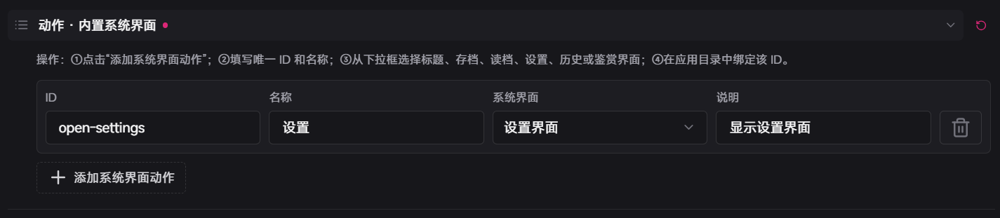
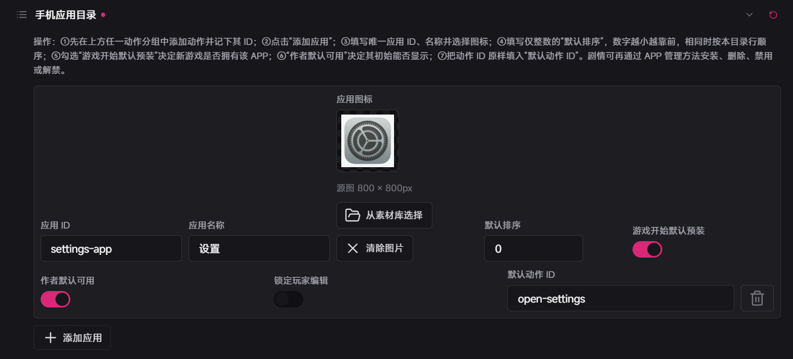
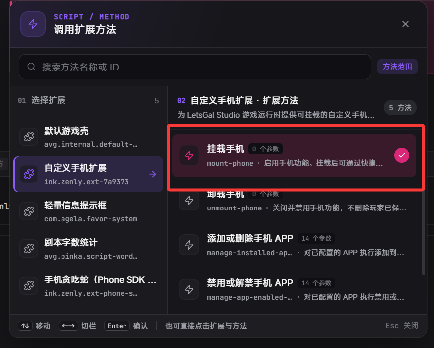

# LetsGal Studio 自定义手机扩展

> 扩展包 ID：`ink.zenly.ext-7a9373`｜ 程序界面：`phone`、`phone-toast`  
> 扩展版本：`1.1.1` ｜ 需要 LetsGal Studio SDK：`>=1.9.0`

这是一个**游戏里的手机**：剧情里挂上之后，玩家可以打开桌面、点 APP、看聊天消息，还能收到简单的提示（Toast）。

本文只讲**作者怎么在 Studio 里用这个扩展**。  
若要自己写手机里的小应用（内页）、用脚手架，请看 [`src/README.md`](src/README.md)。

## 目录

1. [这个扩展能做什么](#1-这个扩展能做什么)
2. [安装与构建](#2-安装与构建)
3. [五分钟做出第一部能用的手机](#3-五分钟做出第一部能用的手机)
4. [手机什么时候能用、怎么打开](#4-手机什么时候能用怎么打开)
5. [作者设置：外观、动作、桌面 APP](#5-作者设置外观动作桌面-app)
6. [剧情里安装 / 禁用 APP，以及 Toast](#6-剧情里安装--禁用-app以及-toast)
7. [玩家能不能自己改手机](#7-玩家能不能自己改手机)
8. [聊天角色与头像](#8-聊天角色与头像)
9. [发手机消息（show-message）](#9-发手机消息show-message)
10. [用哪种 Preview、改完没生效怎么办](#10-用哪种-preview改完没生效怎么办)
11. [自检清单与常见问题](#11-自检清单与常见问题)
12. [更新日志](#12-更新日志)

## 1. 这个扩展能做什么

**可以：**

- 苹果 / 安卓两种手机外壳，桌面一排四个 APP
- 用方向键、鼠标、快捷键打开手机、点开 APP
- 给 APP 绑各种「动作」：打开设置、存档、别的界面，或手机里的小应用
- 剧情里给玩家装上 / 删掉 / 禁用某个 APP（禁用后图标还在，但发灰点不了）
- 装删 APP 时可选弹出 Toast 提示（快进时一般不弹）
- 做聊天对话：对方 / 我方气泡、已读未读、多段消息接上聊
- 可调气泡颜色、字号、要不要显示头像和名字等

**暂时做不到 / 要注意：**

- 玩家不能自己拖图标排序（排序只听作者设置）
- 气泡上的名字来自角色资产，不能随便起昵称（但可以藏头像或藏名字）
- 不会执行任意脚本或打开任意网址，只能用扩展允许的动作

## 2. 安装与构建

需要：Node.js、pnpm，以及 Studio SDK `>=1.9.0`。

在扩展根目录执行：

```powershell
pnpm install
npx tsc --noEmit
pnpm run build
```

Studio 会加载 `extension.json` 里写的 `dist/index.mjs`。  
改完代码或设置表单后：先 `build`，再在 Studio 里重载扩展；不行就重启 Preview。

## 3. 五分钟做出第一部能用的手机

跟着做一遍，就能验证「挂上 → 打开 → 点开设置」。

### 第一步：加一个「打开设置」的动作



打开扩展设置 → **动作 · 内置系统界面**，新增一行，例如：

| 填什么 | 示例 |
| --- | --- |
| ID | `open-settings` |
| 名称 | `设置` |
| 系统界面 | `设置界面` |

ID 建议用小写字母、数字和短横线，不要重复。

### 第二步：在桌面上放一个 APP



到 **手机应用目录** 再加一行：

| 填什么 | 示例 |
| --- | --- |
| 应用 ID | `settings-app` |
| 应用名称 | `设置` |
| 默认排序 | `0`（数字越小越靠前） |
| 游戏开始默认预装 | 打开 |
| 作者默认可用 | 打开 |
| 默认动作 ID | `open-settings`（必须和上一步的 ID **一字不差**） |

### 第三步：在剧情里「挂上手机」



在玩家可以用手机的那段剧情里，加：**调用扩展方法 → 挂载手机**。  
注意：挂载**不会**自动弹出手机，只是让手机「可用」。

### 第四步：用剧本 Preview 试玩


跑**剧本 Preview**，按默认快捷键 `↑`（ArrowUp）打开手机，点「设置」。  
如果一个 APP 都没配好，会先显示内置的存档 / 读档 / 设置等，方便你先看界面。

## 4. 手机什么时候能用、怎么打开

可以把它想成：

```text
剧情里挂上手机（mount-phone）
  ├─ 玩家按快捷键 → 打开普通手机桌面
  ├─ 剧情发消息（show-message）
  ├─ 剧情装/删/禁用 APP
  └─ 不需要时再卸掉（unmount-phone）
```

| 方法 | 干什么 | 正常播放 | 快进 / 跳过 |
| --- | --- | --- | --- |
| 挂载手机 | 让手机可用（不自动弹出） | 生效 | 也生效 |
| 卸载手机 | 关掉界面、结束等待、不能再用 | 生效 | 也生效 |
| 添加或删除 APP | 改玩家有没有这个 APP | 可弹 Toast | 改状态，不弹 Toast |
| 禁用或解禁 APP | 改能不能点 | 可弹 Toast | 改状态，不弹 Toast |
| 显示手机消息 | 弹出聊天，等玩家一条条点 | 会显示 | 不显示 |

小提示：

- 每次进游戏流程，最好重新「挂载」一次（挂载不会写进普通存档）
- 「卸载」不会清掉玩家改过的壁纸、图标，也不会清掉剧情装过的 APP 状态

### 玩家怎么操作普通手机

| 操作 | 效果 |
| --- | --- |
| 打开快捷键（默认 `↑`） | 没打开就打开；已打开时若按的是 `↑`，焦点往上移 |
| 方向键 | 在桌面上挪焦点 |
| Enter / 空格 / 鼠标点 | 打开当前 APP |
| Esc / 关闭按钮 / 点外面 | 关掉手机 |

本扩展对应的「打开手机」动作名是：

```text
ink.zenly.ext-7a9373.open-phone
```

可在扩展设置或 Studio「输入按键」里改键。  
没挂载、正在聊消息、或手机已经开着时，这个打开动作会被忽略。


## 5. 作者设置：外观、动作、桌面 APP

### 5.1 外观长什么样

| 设置 | 白话说明 |
| --- | --- |
| 手机标题 | 桌面顶栏文字，默认「手机」；聊消息时固定显示「消息」 |
| 打开手机快捷键 | 默认 `ArrowUp`；也可写成 `KeyP`、`Ctrl+KeyP` 等 |
| 手机样式预设 | 苹果或安卓外壳（底下颜色、壁纸仍用你自己填的） |
| 手机弹出位置 | 出现在屏幕哪一块 |
| 背景色 / 背景图 / CSS 背景 | CSS 只能写一段背景，不要写 `url()`、分号、花括号 |
| 强调色 / 外壳颜色 | 焦点高亮、我方气泡、手机边框等 |
| 对方回复前将我方未读标为已读 | 默认开。下一条是对方消息、且我方还是「未读」时：先点一下变成「已读」，再点一下才出对方消息。详见 [§9](#9-发手机消息show-message) |

### 5.2 先写好「动作」，再挂到 APP 上

桌面上的每个 APP，都是通过「默认动作 ID」去找一个已写好的动作。  
所以顺序一般是：**先加动作 → 再在应用目录里填这个动作的 ID**。


| 动作分组 | 用来干嘛 |
| --- | --- |
| 程序 UI | 打开程序界面。本扩展填 `ui-id`；别的扩展填 `扩展ID/ui-id`（不要加 `@`） |
| 可视化 UI | 项目 UI 填名字；扩展 UI 填 `@扩展ID/界面名` |
| 内置系统界面 | 标题、工具栏、存档、读档、设置、历史、鉴赏 |
| 手机内部方法 | 快速存档 / 快速读档 / 切换全屏 |
| 手机内部应用 | 打开手机屏幕里的小应用（不关手机外壳） |

动作 ID 发布后尽量别改：桌面和玩家自己改过的绑定都认这个 ID。  
扩展**不会**随便跑脚本；要调别的扩展方法，请用剧本 Fragment +「调用扩展方法」。

#### 怎么查各种 UI 的 ID？

**a. 程序 UI**


在剧本里挂上你要的程序 UI，检查器里就能看到 ID：


**b. 可视化 UI**

写法类似，使用时把前面的 `ui:@` 去掉即可：


**c. 手机内页（小应用）**

一般要问内页作者，或看他们的说明。  
- 别人做的内页扩展：通常是 `扩展ID/内页ID`  
- 本手机扩展自带的内页：往往只要填内页 ID（不用带扩展 ID）


上图里完整写法是 `ink.zenly.ext-phone-snake/phone-snake`；若是手机扩展自己带的内页，写成 `phone-snake` 即可。

### 5.3 手机应用目录（最多 40 个）


| 字段 | 白话说明 |
| --- | --- |
| 应用 ID | 给剧情用的稳定代号（装、删、禁用都认它） |
| 应用名称 | 桌面上显示的名字（最多约 24 字） |
| 应用图标 | 作者给的默认图标 |
| 默认排序 | `0`～`9999`，越小越靠前 |
| 游戏开始默认预装 | 关着的话，新开局桌面上没有，要靠剧情「添加」 |
| 作者默认可用 | 关着会发灰，要点不了，得剧情「解禁」 |
| 锁定玩家编辑 | 打开后玩家改不了这个 APP 的名字/图标/动作 |
| 默认动作 ID | 必须对应一个真实存在的动作；对不上就不会出现在桌面 |

一个动作都没配好时，会暂时用内置的存档/读档/设置等——那只是保底，正式项目请自己配目录。

## 6. 剧情里安装 / 禁用 APP，以及 Toast


记住两件事：

- **删除**：桌面上没了  
- **禁用**：还在桌面上，但发灰、点不开  

### 6.1 添加或删除

剧本里选：**添加或删除手机 APP** → 选操作 → 填最多 8 个「应用 ID」。  
填错的 ID 会被忽略。删除 APP **不会**清掉玩家以前改过的名字、图标等。

### 6.2 禁用或解禁


剧本里选：**禁用或解禁手机 APP**。  
「解禁」不会把已经删掉的 APP 装回来。手机没挂载时也能执行，下次打开手机就能看到结果。


### 6.3 可选的 Toast 提示

在检查器里打开「显示 Toast 通知」后：正常播放会弹提示；快进 / 跳过只改状态、不弹窗。  
可调位置、进出动画、上下叠放。提示文字优先用应用名称，大约显示 2.6 秒。

## 7. 玩家能不能自己改手机

| 开关 | 作用 |
| --- | --- |
| 允许玩家个性化手机 | 总开关。关掉就藏起齿轮，玩家改动也不生效（数据还在，再开还能回来） |
| 允许玩家更换背景 / 图标 | 总开关打开时，分别控制能不能换壁纸、换图标 |

玩家可改：壁纸、安全的 CSS 背景、强调色/外壳色，以及**未锁定** APP 的名字、图标、动作。  
壁纸建议 PNG/JPEG/WebP，不超过 2MB；图标不超过 512KB。

> 这块功能还在完善中，正式项目建议先关掉「允许玩家个性化手机」。

## 8. 聊天角色与头像

发消息时，不要在消息块里直接选立绘，而是先建好「聊天角色预设」，消息里只填预设 ID。

### 头像素材库（可选）

只有头像来源选「扩展素材库」时才需要：给素材起个 ID，再选一张图（最多 80 个）。


### 聊天角色预设


| 字段 | 白话说明 |
| --- | --- |
| 预设 ID | 例如 `mika`，消息块里填这个 |
| 资产角色 | 项目里的角色 |
| 头像来源 | 第一张立绘 / 角色默认头像 / 扩展素材库 |
| 头像素材 ID | 只有选「扩展素材库」才填 |
| 显示头像 / 显示名称 | 默认都开 |
| 字体大小、文字色、名称色、对话框色 | 可改；清空就用默认样式 |
| 自定义 CSS | 新建时是空的；写 CSS 声明列表。和上面颜色等同时填时，**以自定义 CSS 为准** |

名字显示在气泡**上面**并加粗（有点像 QQ）：对方靠左，我方靠右。  
样式在消息开始时就定死了，中途改设置不会改已经发出去的气泡。

消息块里还可以整组强制：显示 / 隐藏头像或名称（默认「跟随预设」）。

小规则：

- 某个样式栏清空 → 这一项退回默认皮肤  
- 自定义 CSS 里不要写 `url()`、`@`、大括号等不安全内容，写错整段会作废  
- 想改气泡四个角圆角：写在自定义 CSS 里  

头像找不到时，会按顺序试：预设来源 → 旧数据 → 角色默认头像 → 第一张立绘 → 名字第一个字。

## 9. 发手机消息（show-message）

### 开始前请确认

- 已经「挂载手机」
- 至少有一个有效的聊天角色预设
- 第 1 条消息填了预设 ID，内容不能空
- 用**剧本 Preview**测（程序 Preview 跑不了剧情消息）

一个方法块最多 8 条消息。

### 每一条消息填什么


| 字段 | 第 1 条 | 第 2～8 条 |
| --- | --- | --- |
| 预设 ID | 必填 | 空着就沿用第 1 条 |
| 内容 | 可多行；空内容会跳过 | 同上 |
| 发送方 | 对方在左 / 我方在右 | 同上 |
| 消息状态 | 默认已读；对方永远显示已读 | 同上 |
| 被拉黑提示 | 只有我方状态是「被拉黑」时才显示 | 同上 |

### 整组一起控制的选项


| 字段 | 默认 | 白话说明 |
| --- | --- | --- |
| 接续上一组 | 否 | 上一组没关手机时，把新消息接在后面 |
| 结束后关闭手机 | 是 | 最后一条之后，玩家再确认一次才关手机、继续剧情 |
| 消息显示位置 | 右下 | 只影响消息手机，不影响普通桌面位置 |
| 聊天背景图 | 空 | 只在这组聊天里用，不改玩家永久壁纸 |
| 显示头像 / 名称 | 跟随预设 | 也可整组强制显示或隐藏 |

### 我方消息状态长什么样

- 发送中：转圈  
- 未读 / 已读：文字标记  
- 失败 / 被拉黑：红色感叹号（被拉黑还会多一行提示）

### 「未读」怎么变成「已读」

扩展设置里有一项：**对方回复前将我方未读标为已读**（默认打开）。

满足下面全部条件时：

1. 屏幕上已经有我方「未读」消息  
2. 下一条马上要出的是**对方**消息  

则：

1. 玩家点一下（或按 Enter / 空格）→ 未读变成已读（**不会**立刻出现对方气泡，也**不会**再播一遍消息飞入动画）  
2. 再点一下 → 才出现对方消息  

如果下一条还是我方，或没有未读，就和平时一样：点一下直接出下一条。  
关掉这个设置后，每次点击都直接推进。

### 玩家怎么一条条看下去

第一条会马上出现 → 点消息区域或按 Enter / 空格看下一条 → 若勾了「结束后关闭」，看完最后一条还要再确认一次才会关手机。  
按 Esc 会关掉消息手机并结束等待。

超过 8 条时：拆成多个消息块。前面几组勾「结束后关闭 = 否」，后面勾「接续上一组 = 是」；两组之间不要「卸载手机」。

## 10. 用哪种 Preview、改完没生效怎么办

| 用哪个 | 适合测什么 | 测不了什么 |
| --- | --- | --- |
| 剧本 Preview | 挂载、装 APP、聊天、接续 | — |
| 扩展程序 Preview | 桌面长什么样、壁纸、布局 | 挂载、快捷键、点 APP、剧情消息 |

每个 Preview 互不干扰，都要各自挂载一次。  
设置面板还是旧字段？先 `pnpm run build`，再重载扩展或重启 Preview。

剧本里方法块上的摘要卡片是辅助显示，真正改参数还是在检查器里。

## 11. 自检清单与常见问题

发剧情前可以勾一遍：

- [ ] 该用手机的地方已经「挂载」；没挂载时快捷键打不开  
- [ ] 方向键 / 鼠标 / Enter·空格能打开 APP，动作 ID 都对得上  
- [ ] 装、删、禁用、解禁表现正确；Toast 在快进时不会乱弹  
- [ ] 个性化开关和「锁定编辑」符合预期  
- [ ] 消息能一条条推进，接续和背景符合预期  
- [ ] 用剧本 Preview 能完整跑通  

| 遇到的情况 | 先查什么 |
| --- | --- |
| 快捷键没反应 | 挂载了吗？快捷键冲突了吗？是不是已经开着手机 / 正在聊消息？ |
| 桌面上没有 APP | 默认预装开了吗？被剧情删了吗？默认动作 ID 对不对？ |
| APP 发灰点不了 | 被禁用了 → 用「解禁」 |
| 点了没反应 | 默认动作 ID 是否和动作表里完全一致 |
| Toast 不出现 | 检查器开了通知吗？是不是快进/跳过？ |
| 消息不出来 | 挂载、预设、第 1 条内容、是否剧本 Preview |
| 接续不上 | 上一组有没有关掉？本组开了接续吗？中间卸过手机吗？ |
| 最后一条后卡住 | 正常：还要再确认一次才会关手机 |
| 头像只剩一个字 | 角色/素材/图片地址；控制台搜 `[phone-avatar]` |

调试时可看控制台里的 `[phone-debug]`、`[phone-avatar]`。

---

写内页、CLI、phone-sdk 的说明和更细的版本表 → [`src/README.md`](src/README.md)

## 12. 更新日志

下面是本扩展（给作者用的包）主要变化。SDK / 脚手架细节见 [`src/README.md`](src/README.md)。

| 版本 | 主要变化 |
|------|------|
| **1.1.1**（当前） | 可选：对方要说话前，先把我方「未读」点成「已读」（再点才出对方消息）；改已读时不再重播飞入动画 |
| **1.1.0** | 气泡样式可配；名字在气泡上方加粗；可藏头像/名字；使用说明和开发说明拆开 |
| **0.2.0** | 苹果/安卓壳、快捷键、APP 装删禁用与 Toast、聊天背景、多 Preview 隔离、玩家个性化等成型 |
| **0.1.3** | 版本与说明整理 |
| **0.1.2** | 聊天头像相关调整 |
| **0.1.1** | 修复手机打不开等问题 |
| **0.1.0** | 第一版：挂载手机、桌面 APP、聊天消息 |
